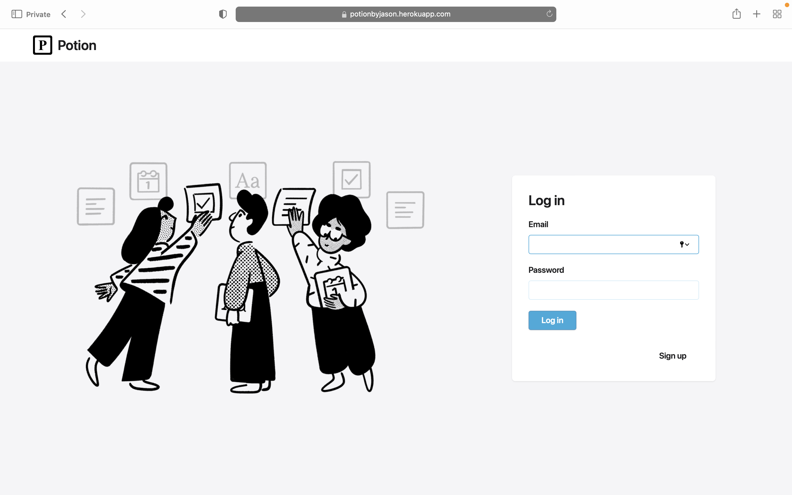
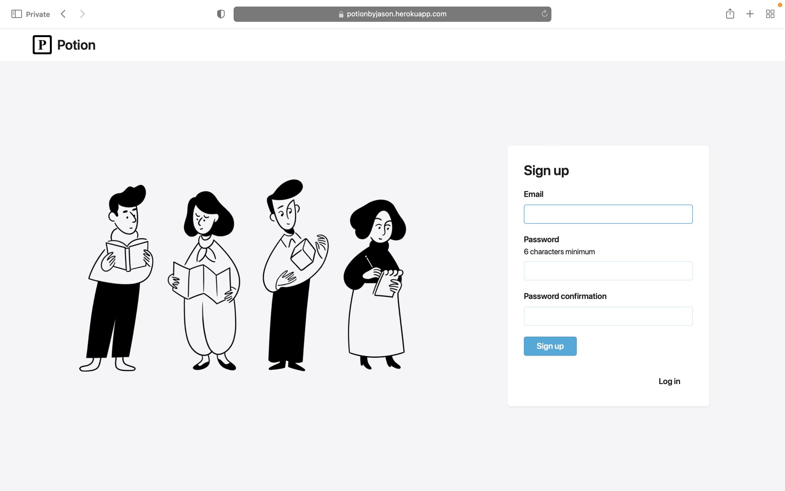
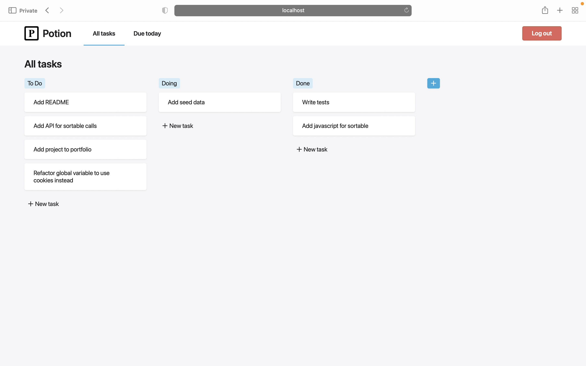

# Potion







## Potion Description

Potion is a task tracking application inspired by a Notion kanban board. Users are able to create categories and create tasks within those categories. Potion also lets users update and delete categories and tasks. For urgent tasks, Potion also includes a Due Today tab where users will only be able to see tasks that have today marked as their deadline

## Demo

[Link to Potion deployed on Heroku](https://potionbyjason.herokuapp.com/users/sign_in)

## Installation and Setup

```text
git clone https://github.com/jason-nn/batch14-todo.git
```

```text
cd batch14-todo
```

```text
bundle install
```

```text
yarn install --check-files
```

```text
bundle exec rails webpacker:install
```

```text
rails db:create
```

```text
rails db:migrate
```

```text
rails db:seed
```

```text
rails server
```
